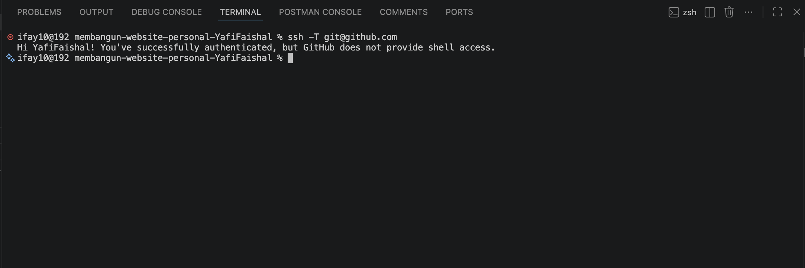
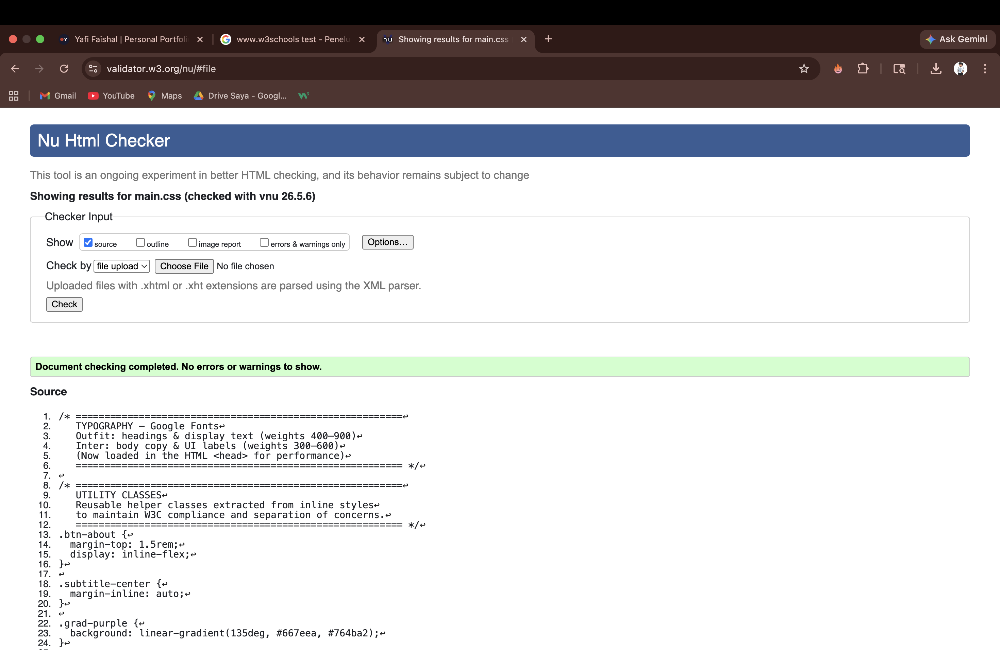
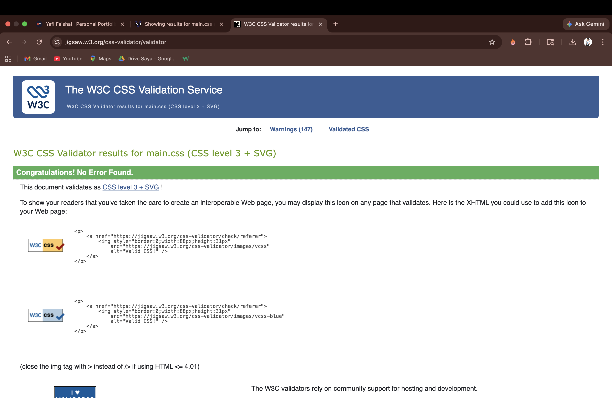
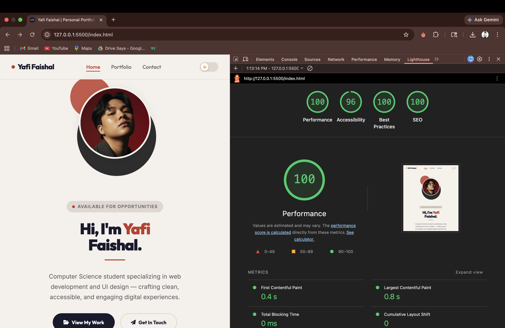
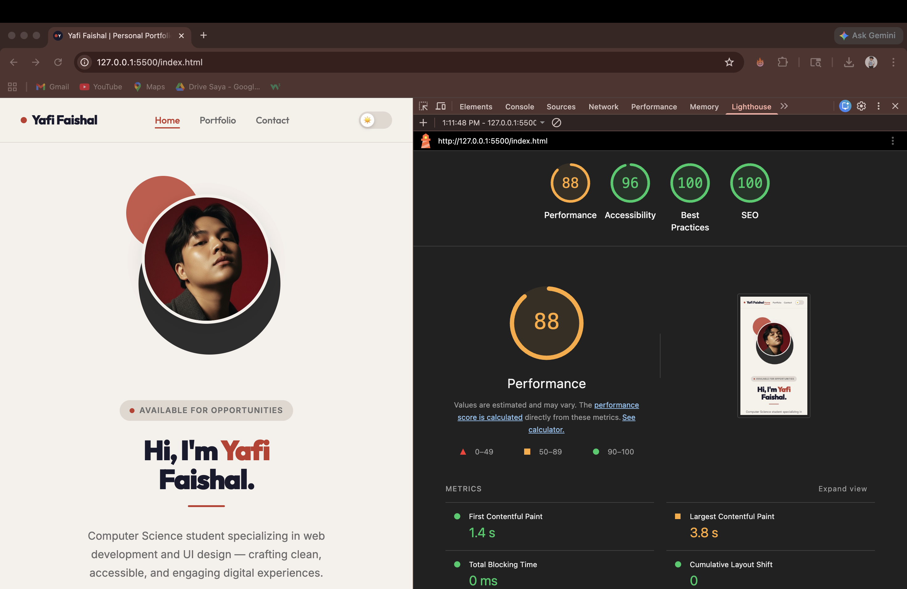

# LAPORAN TUGAS #1 — Membangun Website Personal dengan HTML & CSS

**Nama:** Yafi Faishal
**NIM:** L200240225
**Kelas:** TIF1330
**Mata Kuliah:** Pemrograman Web
**Tanggal Pengumpulan:** 8 Mei 2026

---

## 1. Deskripsi Proyek

Website personal ini dibuat sebagai tugas individu mata kuliah Pemrograman Web. Website ini merupakan **portofolio pribadi statis** yang dibangun menggunakan **HTML semantik** dan **CSS eksternal murni** (tanpa JavaScript atau framework).

### Tujuan
Menampilkan identitas, keahlian, proyek, pengalaman, dan informasi kontak secara profesional kepada siapapun yang mengunjungi website ini.

### Fitur Utama
- Halaman utama dengan hero section, profil, dan daftar skill
- Halaman portofolio dengan daftar proyek dan timeline pengalaman
- Halaman kontak dengan formulir dan informasi kontak lengkap
- Desain responsif (mobile & desktop)
- Animasi fade-in dan hover effect menggunakan CSS murni
- Navigasi antar halaman yang fungsional

### Teknologi yang Digunakan
| Teknologi | Keterangan |
|-----------|-----------|
| HTML5 | Markup semantik (`header`, `nav`, `main`, `footer`, `article`, `section`, `aside`) |
| CSS3 | Layout Flexbox & Grid, animasi keyframe, media queries |
| Google Fonts | Font Outfit & Inter |
| Font Awesome 6 | Ikon-ikon UI |
| GitHub Pages / Vercel | Deployment / hosting |

---

## 2. Struktur Folder dan File

```
membangun-website-personal-YafiFaishal/
├── index.html              ← Halaman Utama (Home)
├── portfolio.html          ← Halaman Portofolio
├── contact.html            ← Halaman Kontak
├── style/
│   └── main.css            ← Semua style (CSS eksternal)
├── assets/
│   └── favicon.svg         ← Favicon kustom
├── images/
│   ├── profile_photo.jpeg  ← Foto profil
│   ├── personal-web-sample1.png
│   └── personal-web-sample2.jpeg
├── LAPORAN.md              ← Laporan ini
└── README.md               ← Instruksi tugas
```

---

## 3. Link Website yang Sudah Di-Host

> 🌐 **https://yafi-personal-website-deploy.vercel.app/**

---

## 4. Screenshot SSH Berhasil Dikonfigurasi



---

## 5. Hasil Validasi W3C

### HTML Validator (validator.w3.org)

> 📸 Tempelkan screenshot hasil validasi HTML untuk masing-masing halaman:



### CSS Validator (jigsaw.w3.org/css-validator)

> 📸 Tempelkan screenshot hasil validasi CSS:



---

## 6. Lighthouse Score (Bonus)

> 📸 Tempelkan screenshot Lighthouse untuk kategori Performance dan Accessibility:

**Desktop:**


**Mobile:**


---

## 7. Catatan Tambahan

- Semua style menggunakan file CSS eksternal (`style/main.css`) — tidak ada inline style
- Semua gambar memiliki atribut `alt` yang deskriptif
- Navigasi dapat diakses dengan keyboard (tombol Tab)
- Warna teks dan latar belakang memenuhi rasio kontras minimal 4.5:1
- Struktur HTML menggunakan tag semantik secara konsisten di ketiga halaman
